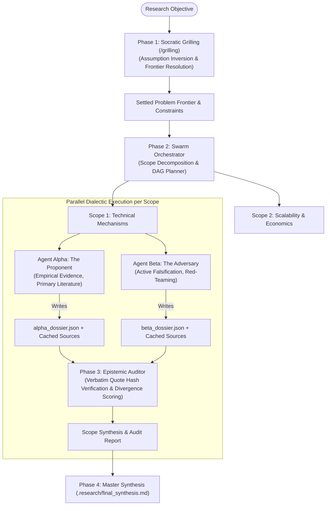

# Epistemic Swarm 🌟

[](https://www.npmjs.com/package/@heretek-ai/epistemic-swarm)
[](https://opensource.org/licenses/Apache-2.0)
[](https://github.com/Heretek-AI/IUMBTEMS/actions)

> **High-Integrity Dialectic Research Agent Harness for Claude Code**  
> *Enforcing verified empirical evidence over parametric hallucination.*

---

## 🎯 The Epistemic Mandate

Current AI research assistants suffer from parametric hallucination, sycophancy, and premature narrative consensus. They invent citations, smooth over technical contradictions, and extrapolate beyond empirical bounds.

**Epistemic Swarm** is an autonomous, dialectic research harness built on top of [Claude Code](https://claude.ai/code) (`~/.claude/` and `~/.claude.json`). It enforces **evidentiary primacy** through:
1. **Mathematical Evidentiary Tags**: Every factual claim is tagged `[VERIFIED: <hash>]`, `[INFERRED: ...]`, `[HYPOTHESIS: ...]`, or `[NEGATIVE_KNOWLEDGE: ...]`.
2. **Dialectic Swarm Architecture**: Competitively dispatches **Agent Alpha** (The Thesis / Primary Literature Proponent) and **Agent Beta** (The Antithesis / Hostile Red Team / Active Falsifier).
3. **Content-Addressed Source Caching**: Web pages and papers are hashed to SHA-256 (`.research/sources/<sha256>.md`).
4. **Algorithmic Epistemic Auditor**: Verifies cited quotes verbatim against the raw source cache, downgrades fabricated claims, scores divergence, and synthesizes the unvarnished empirical truth.
5. **Socratic Grilling & Divergent Ideation**: Matt Pocock-style design tree traversal that explores assumption inversions and clarifies constraints *before* committing to search queries.

---

## 🏗️ System Architecture



---

## ⚡ Quickstart

### Option 1: Run via NPX (Zero Setup)
```bash
# Execute deep research swarm directly
npx @heretek-ai/epistemic-swarm run "Evaluate FPGA Poseidon prover latency bounds"

# Run Socratic decision tree framing
npx @heretek-ai/epistemic-swarm grill --objective "L1 vs L2 state verification trade-offs"
```

### Option 2: Install into Claude Code Environment
```bash
git clone https://github.com/Heretek-AI/IUMBTEMS.git
cd IUMBTEMS
npm run install-local
```
This automatically symlinks the `/grilling` and `/research-cache` skills into `~/.claude/skills/` and configures MCP servers in `~/.claude.json`.

---

## 🏷️ Epistemic Tagging Taxonomy

| Tag | Meaning | Requirement |
| :--- | :--- | :--- |
| `[VERIFIED: <hash>]` | Direct empirical fact backed by primary source. | Verbatim quote must exist in `.research/sources/<hash>.md`. |
| `[INFERRED: <reasoning>]` | Deductive conclusion from verified facts. | Must list parent verified claims and deductive step. |
| `[HYPOTHESIS: <test>]` | Speculative assertion or projection. | Must define a measurable falsification criterion. |
| `[NEGATIVE_KNOWLEDGE: <query>]` | Verified absence of empirical evidence. | Records exact search query and confirmed literature gap. |

---

## 🔍 Multi-Tier OSINT & Search Pipeline

1. **Discovery Tier**: SearXNG (metasearch) and Brave Search API.
2. **Extraction Tier**: Firecrawl (headless JavaScript rendering, DOM cleaning, Markdown extraction).
3. **Academic Tier**: Semantic Scholar / arXiv MCPs for DOI resolution.
4. **Caching Tier**: Content-addressed SHA-256 storage (`skills/research-cache/hasher.py`).

### Optional Turnkey Infrastructure (SearXNG + Firecrawl)
To run your own unbiased metasearch and headless extractor locally:
```bash
docker compose -f config/docker-compose.infra.yml up -d
```

---

## 🧪 Testing

Epistemic Swarm comes with an automated test suite verifying source hashing, quote substring matching, IPC state transitions, and mock swarm dispatch:

```bash
npm test
```

---

## 📦 Deployment & CI/CD

This package is distributed via npm under `@heretek-ai` with [npm Trusted Publishing (OIDC)](https://docs.npmjs.com/trusted-publishers) and GitHub Actions.

### First-Time Publication (One-Time Bootstrap)
1. Authenticate locally:
   ```bash
   npm login
   ```
2. Publish initial version:
   ```bash
   npm publish --access public
   ```
3. In `npmjs.com/package/@heretek-ai/epistemic-swarm/access`, add **GitHub Actions** as a Trusted Publisher for repository `Heretek-AI/IUMBTEMS` and workflow `.github/workflows/publish.yml`.
4. Subsequent releases publish automatically upon pushing a GitHub Release or git tag!

---

## 📄 License

Licensed under the Apache License, Version 2.0. See [LICENSE](LICENSE) for details.
