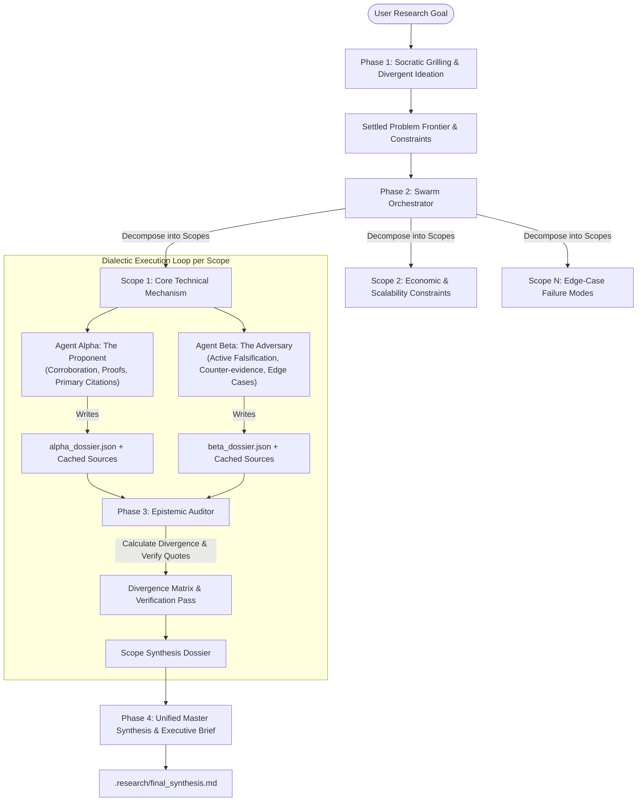
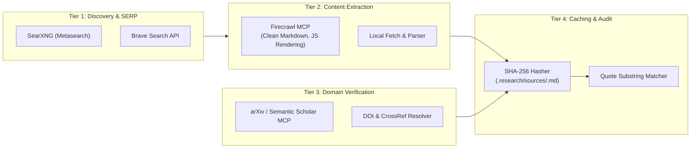
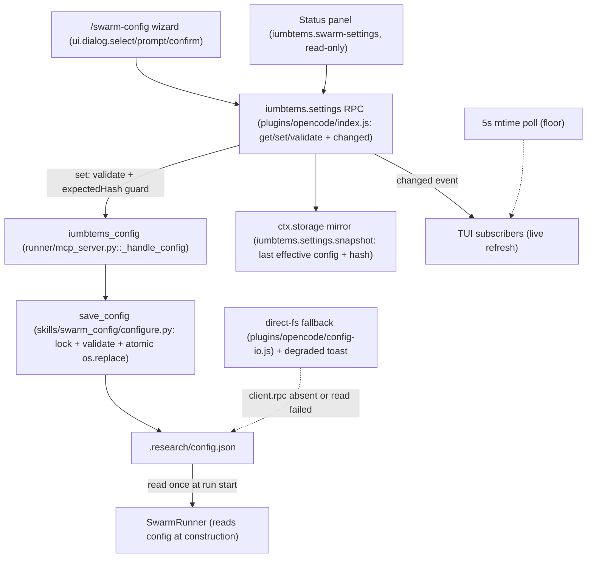

# IUMBTEMS (Epistemic Swarm): System Architecture & Technical Specification

## 1. Architectural Mandate & Epistemic Foundations

Modern large language models suffer from severe parametric leakage and sycophancy when executing deep research: models hallucinate nonexistent citations, conflate correlational claims with causal proofs, and smooth over scientific controversies to generate artificially unified prose.

**IUMBTEMS** — shipped as the **Epistemic Swarm** harness — is an autonomous research system that runs across seven agent harnesses (Claude Code, OpenCode V2, Pi, OMP, Gemini CLI, Codex CLI, AntiGravity) on their host-native agent backends, designed around one governing constraint: **Evidentiary Primacy over Parametric Intuition**.

### 1.1 Formal Evidentiary Taxonomy
Every factual assertion, quantitative metric, historical claim, or entity relationship produced by any agent in the harness must carry an explicit, machine-parseable epistemic classification:

| Tag | Formal Definition | Verification Requirement |
| :--- | :--- | :--- |
| `[VERIFIED: <SourceID/Hash>]` | Grounded directly in verbatim text retrieved during the active research session. | Content-addressed SHA-256 hash in `.research/sources/<sha256>.md` with exact substring match. |
| `[INFERRED: <Reasoning Chain>]` | Deductive or inductive conclusion derived logically from one or more verified facts. | Explicit list of parent verified claim IDs ($C_1, C_2 \implies C_{\text{inferred}}$) with step-by-step logic. |
| `[HYPOTHESIS: <Falsification Metric>]` | Plausible hypothesis, speculative mechanism, or open projection requiring testing. | Defined falsification criterion or empirical test that would disprove it. |
| `[NEGATIVE_KNOWLEDGE: <Topic/Query>]` | Explicit declaration that indexed search corpuses returned null or contradictory findings. | Record of search queries, parameters, and negative SERP summaries. |

### 1.2 Mathematical Epistemic Scoring Function
To prevent conversational drift and hallucination, each generated dossier is scored by an Epistemic Auditor using the following objective function:

$$\mathcal{E}(D) = \frac{\alpha \sum_{i=1}^{N_v} \mathcal{V}(c_i) + \beta \sum_{j=1}^{N_n} \mathcal{N}(k_j) - \gamma \sum_{k=1}^{N_u} \mathcal{U}(u_k)}{N_v + N_i + N_h + N_n + N_u}$$

Where:
- $N_v$: Number of verified assertions with valid source hashes.
- $\mathcal{V}(c_i)$: Verification weight proportional to source tier (Peer-reviewed DOI = 1.0, Technical Documentation = 0.8, Primary Press/Filings = 0.7, Secondary Media = 0.4).
- $N_n$: Count of explicit negative knowledge discoveries.
- $\mathcal{N}(k_j)$: Negative knowledge bonus factor ($\beta = 0.5$).
- $N_u$: Count of ungrounded or unverified factual claims.
- $\mathcal{U}(u_k)$: Severe hallucination penalty ($\gamma = 2.5$).
- $N_i, N_h$: Count of inferred claims and open hypotheses.

Any dossier where $\mathcal{E}(D) < 0.65$ is rejected by the auditor and re-queued for empirical retrieval.

---

## 2. Dialectic Multi-Agent Swarm

The system replaces single-threaded LLM research with a decentralized dialectic swarm executed locally on the invoking harness's native backend — `claude -p` on Claude Code, `opencode run` on OpenCode V2 (selected via `IUMBTEMS_HOST`):



### 2.1 Swarm Roles & Postures
1. **Swarm Orchestrator (`orchestrator.md`)**:
   - Parses the initial problem statement and Socratic frontier.
   - Decomposes the inquiry into decoupled, orthogonal sub-scopes.
   - Emits `.research/manifest.json` containing the dependency DAG, sub-scope IDs, required source tiers, and hypothesis lists.

2. **Agent Alpha (The Proponent / Thesis - `agent_alpha_thesis.md`)**:
   - Posture: Constructive, empirical, affirmative.
   - Objective: Search for working implementations, benchmark results, mathematical proofs, peer-reviewed validations, and foundational literature.
   - Mandate: Every affirmative statement must point to an indexed primary source in `.research/sources/<sha256>.md`.

3. **Agent Beta (The Adversary / Antithesis - `agent_beta_antithesis.md`)**:
   - Posture: Hostile auditor, red-teamer, active falsifier.
   - Objective: Probe for failure states, retracted papers, replication crises, confounding variables, edge-case regressions, patent/licensing bottlenecks, and vendor lock-in.
   - Mandate: For every thesis claim in the scope, search deliberately for inverted queries (`"why [claim] fails"`, `"[claim] debunked"`, `"[claim] performance degradation"`).

4. **Epistemic Auditor (The Synthesizer - `epistemic_auditor.md`)**:
   - Posture: Neutral judge, citation verifier, and mathematical synthesizer.
   - Objective:
     1. Read `alpha_dossier.json` and `beta_dossier.json`.
     2. Query the local cache to verify that all cited quote strings exist verbatim in `.research/sources/<sha256>.md`.
     3. Calculate the **Divergence Score** $D_{\alpha\beta} \in [0, 1]$.
     4. Excise any assertion marked `[VERIFIED]` that fails hash verification.
     5. Synthesize conflicting viewpoints into an unvarnished balance sheet of empirical truths.

---

## 3. Filesystem IPC Protocol & State Machine

The swarm uses a zero-external-dependency filesystem IPC protocol rooted at `.research/` within the repository workspace.

```
.research/
├── manifest.json                  # Global session metadata, scope DAG, status
├── sources/                       # Content-addressed raw document cache
│   ├── a1b2c3d4...9f.json         # Metadata: URL, title, HTTP headers, timestamp, query
│   └── a1b2c3d4...9f.md           # Verbatim cleaned Markdown extraction
├── scratchpads/
│   ├── scope_01_mechanisms/
│   │   ├── manifest.json          # Scope status: PENDING | ALPHA_RUNNING | BETA_RUNNING | AUDITING | DONE
│   │   ├── alpha_dossier.json     # Proponent's structured empirical findings
│   │   ├── alpha_dossier.md       # Proponent's narrative brief
│   │   ├── beta_dossier.json      # Adversary's structured counter-evidence
│   │   ├── beta_dossier.md        # Adversary's narrative red-team report
│   │   ├── audit_report.json      # Quote verification log, divergence score, trimmed claims
│   │   └── scope_synthesis.md     # Synthesized consensus for Scope 01
│   └── scope_02_scalability/
│       └── ...
└── final_synthesis.md             # Master synthesized research report with epistemic provenance
```

### 3.1 State Transitions
```
[PENDING]
    │
    ▼ (Dispatch worker thread)
[ALPHA_DISPATCHED] ──┐
    │                 │ (Concurrent execution)
    ▼                 ▼
[ALPHA_RUNNING]    [BETA_DISPATCHED]
    │                 │
    ▼                 ▼
[ALPHA_COMPLETE]   [BETA_RUNNING]
    │                 │
    └────────┬────────┘
             ▼
      [BETA_COMPLETE]
             │
             ▼ (Spawn Epistemic Auditor)
        [AUDITING]
             │ (Verify hashes, check quotes, score divergence)
             ▼
        [SYNTHESIZING]
             │
             ▼
        [COMPLETE]
```

### 3.2 Scratchpad Schema Definitions

#### `manifest.json` (Global Session)
```json
{
  "session_id": "epistemic-swarm-2026-09-26-001",
  "objective": "Evaluate feasibility of sub-millisecond zero-knowledge state updates on L1 rollups",
  "status": "RUNNING",
  "created_at": "2026-09-26T12:00:00Z",
  "scopes": [
    {
      "scope_id": "scope_01_prover_latency",
      "title": "Hardware Prover Latency & Memory Footprint",
      "dependencies": [],
      "status": "IN_PROGRESS"
    },
    {
      "scope_id": "scope_02_recursion_overhead",
      "title": "Recursive SNARK/STARK Verification Overheads",
      "dependencies": ["scope_01_prover_latency"],
      "status": "PENDING"
    }
  ],
  "telemetry": {
    "total_sources_cached": 42,
    "total_claims_verified": 118,
    "unverified_claims_pruned": 7
  }
}
```

#### `alpha_dossier.json` / `beta_dossier.json`
```json
{
  "agent": "Agent Alpha (Thesis)",
  "scope_id": "scope_01_prover_latency",
  "timestamp": "2026-09-26T12:05:30Z",
  "claims": [
    {
      "claim_id": "C-01-001",
      "tag": "VERIFIED",
      "statement": "FPGA-accelerated Poseidon hash provers achieve sub-200ms witness generation on 2^20 constraints.",
      "source_hash": "e3b0c44298fc1c149afbf4c8996fb92427ae41e4649b934ca495991b7852b855",
      "source_url": "https://arxiv.org/abs/2405.xxxxx",
      "verbatim_quote": "Our FPGA pipeline executes the Poseidon round constraints in 184ms with a peak memory bandwidth of 45 GB/s."
    }
  ],
  "negative_knowledge": [
    {
      "query": "GPU Poseidon provers < 50ms latency memory bandwidth constraints",
      "finding": "No published benchmark confirms sub-50ms prover latency under consumer PCIe 4.0 bandwidth limitations."
    }
  ]
}
```

---

## 4. Multi-Tier Search & Content Caching Pipeline

The harness integrates four functional tooling layers:



### 4.1 Content-Addressed Caching
Every web page, paper abstract, or document retrieved is immediately ingested by `skills/research_cache/hasher.py`:
1. Strips HTML boilerplate and scripts, converting to clean GitHub-Flavored Markdown.
2. Computes the SHA-256 digest of the normalized text content.
3. Saves `.research/sources/<sha256>.md` and `.research/sources/<sha256>.json` containing retrieval provenance (timestamp, search query, original URL, response code, and HTTP headers).
4. The agent is provided with the `<sha256>` hash.
5. In downstream synthesis, when the agent cites `[VERIFIED: sha256]`, the Epistemic Auditor verifies that `verbatim_quote` is an exact substring within `.research/sources/<sha256>.md`. If substring lookup fails, the claim is rejected.

### 4.2 Provider Ladder, Cost Reporting & the Snippet/Witness Contract

OpenCode V2 can host a plugin-provided search provider (`websearch.transform`); IUMBTEMS registers one provider (`iumbtems-cached`) that resolves its upstream from a **free-first ladder** and never overrides a user's deliberate `websearch.provider` or a provider the user `/connect`ed. ("Cached" names the surrounding evidence pipeline — `hasher.py` content-addresses the full page after an explicit `webfetch` — not in-execute memoisation.)

| Rung | Provider | Tier | Notes |
| :--- | :--- | :--- | :--- |
| 0 | `/connect`-ed provider (integration store) | **metered** | Reported by the host; credential lives in the integration store, not our env. |
| 1 | BYO key: `exa` / `firecrawl` / `parallel` / `tavily` / `tinyfish` | **metered** | Vendor-billed via `EXA_API_KEY` / `FIRECRAWL_API_KEY` / `PARALLEL_API_KEY` / `TAVILY_API_KEY` / `TINYFISH_API_KEY`. |
| 2 | self-hosted SearXNG (`SEARXNG_URL`) | free | `docker compose -f config/docker-compose.infra.yml up -d`; availability requires the URL (explicit selection alone does not make it reachable). |
| 3 | DuckDuckGo Lite | free | Zero-key default; runs through `skills/epistemic_search/scripts/search.py` so anomaly detection and telemetry apply. |
| 4 | Console (hosted) | **metered** | `$0.01`/successful search; **never implicit** — only when explicitly selected. |

**Snippet/witness contract.** A search provider returns *hits* (`title`, `url`, `content`) only. Full page content is fetched explicitly by the agent via the host `webfetch` tool and cached through `python3 skills/research_cache/hasher.py cache …`. A search **snippet alone can never witness a `[VERIFIED: <hash>]` claim** — the auditor still requires a verbatim substring match in `.research/sources/<sha256>.md`.

**Cost reporting.** `runner/preflight.py` resolves the active provider, classifies it `free`/`metered` (BYO keys count as metered), counts only searches that flowed through OUR path (`.research/retrieval.jsonl`), and prints an explicitly-labelled estimate:

```
search: <provider> (<free|metered>) | our-path searches: N (~$X est) | metered-mode: <yes|no|unknown>
```

Vendor pricing is unknown, so a BYO provider reports `~$? est, vendor-billed`; metered detection is best-effort and emits `unknown` rather than guessing. The count is **per run**: the runner passes the byte offset captured at start, and the reachability probe is excluded, so a zero-search run reports `our-path searches: 0`. Metered rungs executed by the plugin provider append their own `query` events (provider + status) through the same log.

### 4.3 Mode-Aware Availability Gate

Preflight fails fast **before any agent spawns** when a retrieval-requiring mode (`research`, `scout`, `darkharvest`, `hybrid`, and `brainstorm` once `strict` — including `--domain-pack` on the CLI) has no usable search — the gate HALTs with an actionable fix naming a BYO key, SearXNG, or a DuckDuckGo retry. Engine aliases are canonicalised (`ddg`/`DuckDuckGo`/`DDG`/whitespace → `duckduckgo`) before the probe, so no alias can skip it. `audit` and internal `brainstorm` warn and proceed; an implicit Console warns loudly about the `$0.01` metered charge and is never overridden. Inconclusive probes (skipped/offline) warn, never halt. The workspace `websearch-state.json` is **advisory**: it is read only while fresh (24h TTL, `STATE_CONNECTED_TTL_SECONDS`), resolved in a **single read** (provider and advisory verdict together, so a file swapped between reads cannot be mistaken for host-confirmed), only when the path is a **regular file**, and under a bounded non-blocking read so a FIFO/device/symlink cannot hang preflight or `doctor`. It never marks a provider usable without a resolvable credential or the host-confirmed env channel, so a forged/stale file cannot suppress the halt; the plugin deletes it when `/connect` reports zero providers. A HALT exits non-zero (`EXIT_PREFLIGHT_HALT = 3`, deliberately distinct from argparse's usage-error `2`) so CI can detect the refusal; `--dry-run` validates and reports but never halts.

The opt-in cost gate writes the ask rule to the user's OpenCode config (`install.sh --search-gate`):

```jsonc
{ "permissions": [ { "action": "websearch", "resource": "*", "effect": "ask" } ] }
```

The websearch permission action uses the search query as the resource, so `"*"` gates every search; without `--search-gate`, `install.sh` never touches permissions. The gate never downgrades an existing `websearch` `deny` (it refuses, exit non-zero, config untouched) and preserves/reports resource-scoped websearch rules rather than silently deleting them.

---

## 5. Socratic Grilling & Divergent-to-Convergent Balance

To prevent prematurely narrowing the scope of research onto biased search terms, the harness implements a mandatory two-phase cognitive workflow:

### Phase 1: Divergent Socratic Exploration (`skills/grilling`)
Based on Matt Pocock's design tree and frontier methodology:
1. **Assumption Inversion**: The agent inverts every default assumption (e.g., *"What if low latency is unnecessary if pipelined throughput is infinite?"*).
2. **Design Tree Mapping**: The inquiry is modeled as a decision DAG where every leaf node is an open prerequisite.
3. **The Frontier**: Questions whose prerequisites are settled are posed in systematic rounds.
4. **Factual Delegation**: When a question depends on an unknown empirical fact, the agent dispatches a research subagent to resolve it autonomously without interrogating the user.
5. **Decisional Resolution**: When a question involves trade-offs or priorities, the agent asks the user and locks the answer into the frontier.

### Phase 2: Convergent Dialectic Falsification
Once the frontier is resolved, the Orchestrator freezes the problem space and transitions to the dialectic multi-agent swarm for empirical retrieval, falsification, and epistemic auditing.

### Frontier Tooling & Atomicity
The frontier is fully tool-drivable: `skills/grilling/socratic_tree.py --add-node/--settle/--export` and `iumbtems_socratic_frontier` actions `add|export|settle|inspect`. Frontier writes are atomic (unique temp file + `os.replace`) and serialized by an advisory lock spanning the whole load→mutate→write transaction — parallel `add` calls cannot corrupt `.factory/frontier.json`.

---

## 6. Multi-Harness Runtime & Backends

The harness runs on seven targets from one canonical source. `skills/*` + `prompts/*` are the single source of truth; `runner/mcp_server.py` is the canonical programmatic surface; every other target carries only generated thin stubs.

| Layer | Location |
| :--- | :--- |
| Canonical prose & scripts | `skills/*/SKILL.md`, `prompts/*.md` |
| Canonical programmatic surface | `runner/mcp_server.py` (stdio MCP, `iumbtems_*` tools) |
| Generated stubs (never hand-edit) | `plugins/{antigravity,gemini,codex}/skills/**`, `.agents/skills/**` |
| Generated modular copies | `plugins/{research-cache,socratic-grilling,darkharvest,factory}/skills/**` |
| Generator / CI gate | `scripts/build_adapters.py` (`--check` fails CI on drift) |
| OpenCode V2 plugin | `plugins/opencode/index.js` (transform domains: tool/command/agent/skill) |

### 6.1 Agent Runtime Resolution

Agent processes are spawned on the **host-native backend** by default, resolved in this precedence order:

1. Explicit override (`--backend` on the CLI, `backend` argument on the MCP tools)
2. Environment (`IUMBTEMS_BACKEND_<ROLE>`, `IUMBTEMS_MODEL_<ROLE>`)
3. Config (`.research/config.json` → `agents.<role>.backend` / `agents.<role>.model`)
4. Host-native default (`opencode run` when `IUMBTEMS_HOST=opencode`, else `claude -p`)

### 6.2 Workspace Resolution and Spawn Semantics

The evidence workspace is resolved in this order:

1. Explicit `base_dir` / `dir` argument
2. `IUMBTEMS_PROJECT_DIR` (set by the OpenCode plugin to the session workspace — the V2 web UI targets worktrees)
3. Process cwd (manual CLI runs) — the definitive path

Spawned agents run with their OS cwd **and** `PWD` set to the project root, because some harnesses (OpenCode) resolve their project root from `$PWD` rather than the OS cwd. Both are kept consistent so relative `.research/...` paths and absolute scratchpad paths agree; a mismatch sends evidence into a different tree than the auditor reads.

### 6.2.1 Linked Worktrees and the `external_directory` Trap

`git worktree add` creates a checkout whose **git common dir lives in another directory tree** (the primary clone). Some harnesses derive their project root from `git rev-parse --git-common-dir` / `--show-toplevel` and from `$PWD`, so a spawned agent can consider the primary clone its workspace while the runner reads the worktree. When that happens the runner's absolute scratchpad path is classified `external_directory` and **auto-rejected**, so no dossier is persisted.

Three defenses:

1. Spawn with `cwd` and `PWD` set to the resolved project root (see 6.2), so the child's workspace matches the runner's.
2. Pass `--auto` to `opencode run` (auto-approve permissions that are not explicitly denied), so an `external_directory` write is approved rather than silently dropped. Disable with `IUMBTEMS_OPENCODE_AUTO=0`.
3. On a missing dossier, report the searched path, the spawn cwd/`PWD`, `IUMBTEMS_PROJECT_DIR`, and any copy found in an alternate workspace (`PWD` / git common dir parent) — a workspace mismatch is then self-diagnosing instead of a bare `dossier not found`.

### 6.2.2 Manifest Concurrency

`.research/manifest.json` is written by multiple tools/processes. It is now per mode (`manifest.<mode>.json`; the default/research flow keeps `manifest.json`) so concurrent `brainstorm` and `darkharvest` runs cannot clobber each other's scope DAG. Every manifest write uses a **unique** temp file plus `os.replace`, under an `fcntl` advisory lock at `.research/.manifest.lock`, and read-modify-write helpers (`update_session_status`, `set_scopes`, `record_agent_completion`, `update_scope_status`) hold that lock across the whole operation so concurrent writers cannot lose updates. Mode-agnostic readers resolve with `state_machine.find_any_manifest`.

### 6.2.3 Dossier Contract and Derived Status

Each dialectic agent is given an explicit output contract in its prompt: the absolute path of **its** dossier (`alpha_dossier.json` / `beta_dossier.json`), and an instruction never to write the runner-owned `manifest.json`. The loader (`_load_agent_dossier`) resolves the canonical path first, then a bounded set of mode aliases (`brainstorm` → `brainstorm_dossier.json`) and the scope manifest's `outputs` list, normalizing any hit to the canonical filename (tagged `renamed_from`).

Scope completion is **derived from artifacts on disk** (`ResearchStateMachine.reconcile_scope_status`): `alpha_completed`/`beta_completed` reflect whether the dossier files exist, and the status is recomputed from them. Because agents can write anywhere in the workspace, a stored boolean is not trusted — a hand-edited or agent-written `manifest.json` claiming `DOSSIERS_READY` is corrected on the next reconcile.

### 6.3 Grounding, Retrieval Telemetry & Scoring Contracts

**Retrieval telemetry.** Agents invoke the retrieval skills as subprocesses, so their activity is only visible through a shared append-only log: `search.py`, `hasher.py`, and `webcache.py` append to `.research/retrieval.jsonl` (`query` / `cache` events). Every run prints and records a one-line banner — `retrieval: N queries, M results, K cached` — which makes an ungrounded run obvious instead of inferring it from an empty `sources/`. The runner points agent subprocesses at the workspace via `IUMBTEMS_RESEARCH_DIR`.

**Scoring contracts are per mode.** `compute_epistemic_score_from_claims` (research/audit/scout/darkharvest) credits only quote-verified claims. `compute_brainstorm_score_from_claims` credits *well-formed speculation* — hypotheses carrying a `falsification` criterion, inferences naming their parents — with the usual negative-knowledge bonus, penalizing only rejected `VERIFIED` claims. Brainstorm therefore does not fail a mode whose deliverable is speculative by design.

**Tag counting.** Only structured claim objects (`affirmative_claims`, `falsification_claims`, `inferred_implications`, `hypotheses`, `negative_knowledge`) that carry `source_hash` **and** `verbatim_quote` can be verified. Markdown `[VERIFIED: …]` strings in narrative prose are not counted, and `[VERIFIED: NO …]` honest-negatives are narrative signals rather than verified citations.

**The summary must match the audit.** The master synthesis computes scope totals *before* writing its executive summary and warns (`WARNING_LOW_GROUNDING`) when nothing was verified, instead of asserting that every statement is backed by the source cache.

### 6.4 Darkharvest Audit Contract

Darkharvest dossiers carry `candidate_repositories[]` rather than the standard claim keys, so `runner/darkharvest_claims.py` supplies three things:

- **Normalization** — `normalize_dossier_claims` folds candidates (and their verdicts) into `{claim_id, source_hash, verbatim_quote, statement}` so the auditor, PCRB, and ledger share one schema; entries lacking a witness are counted as rejected rather than silently absent.
- **License cross-check** — `cross_check_repos` compares `license` / `license_risk` / `harvest_policy` across alpha and beta for each repo. Any disagreement is **blocking**, resolved conservatively to `clean-room-rebuild-only`; the scope verdict becomes `WARNING_LICENSE_CONFLICT`. This exists because a dialectic produced `MIT`/`depend-or-vendor` (alpha) against `NOASSERTION`/`clean-room-rebuild-only` (beta) for the same repo and nothing compared them.
- **Ground truth** — `RepoValidator` checks existence (404), the GitHub license field, and `archived` status. It is injectable and fail-open: network failures yield `exists=None` and block nothing (`IUMBTEMS_REPO_VALIDATE=0` disables). Mock mode never validates.

Agent-authored audit-shaped fields are renamed to `self_reported_*` and never counted. The per-scope §3 text is verdict-driven (no more static "100% of cited assertions verified"). Orphaned scope dirs are listed in `.research/orphans.json` and never auto-deleted.

### 6.5 Contracts, Preflight, and Run Lifecycle

**Contracts are generated.** `runner/schemas.py` is the source of truth for `alpha_dossier`, `beta_dossier`, `audit_report`, `manifest`, `scope_manifest`, and `frontier`; `python3 scripts/gen_schemas.py` renders `schemas/*.schema.json` and `--check` fails CI on drift. `runner/schema_validate.py` is a dependency-free subset validator; dossiers are checked **warn-on-load** so a missing key is named without aborting the run.

**Preflight.** Every swarm prints a preflight line — plugin version, backend family + resolved binary path, engine with a live one-query probe (timeout-bounded, skippable), and a workspace write test — and records it in the manifest under `preflight`. It is also exposed as the `iumbtems_doctor` tool. `iumbtems_test` runs the suite in a subprocess.

**Run lifecycle.** Runs stamp the plugin version + backend and warn if the version changes mid-run; they write `.research/progress.json` per scope; `--resume` continues a session with existing scopes instead of re-orchestrating; `--dry-run` validates configuration without spawning agents. Failures raise typed `runner/errors.py` errors carrying code, searched/written paths, workspace, spawn cwd, and a suggested fix.

**Run-scoped layout (opt-in).** With `IUMBTEMS_RUN_SCOPED=1`, artifacts live under `.research/runs/<run_id>/` with a `latest.json` pointer; `find_any_manifest` and PCRB resolve across both layouts. Default remains the flat layout pending a live end-to-end run.

**Factory gate.** `iumbtems_factory` (and the CLI) expose `gate open|settle|approve|waive|escalate|count` as first-class state, and `phase-add` writes its own `phase.json` — it never overwrites author-written `GOAL.md`/`dossier.json` (refused unless `--force`).

### 6.6 Configuration Merge & Migration

`load_config` deep-merges the `agents` block one role/key at a time over `DEFAULT_CONFIG`. Configs written before 0.7.6 that pinned `agents.<role>.backend = ["claude", "-p"]` are migrated to `null` on load (unless the top-level `backend` is an explicit `"claude"`), and the migration is persisted by the CLI and `iumbtems_config` on a config **write** (a read / `--show` never heals).

### 6.7 Settings Surface: TUI → RPC → Canonical Writer

The interactive settings surface (`/swarm-config`, phases 01-03) is a thin control plane over the same canonical file the runner already reads — it adds no second config dialect.



**Data flow.** The wizard writes through the server `iumbtems.settings` RPC (`get`/`set`/`validate`, plus a `changed` event), which delegates the actual write to the canonical Python surface `iumbtems_config` (`runner/mcp_server.py::_handle_config` → `save_config`). The runner (`runner/research_swarm.py`) reads `.research/config.json` **once at construction**, so every change is "next run": the wizard/panel carry that badge and the runner never hot-swaps a live swarm.

**Fallback path.** When `client.rpc` is absent (or an RPC read fails), the TUI writes directly via `plugins/opencode/config-io.js` and shows a visible degraded toast; the same schema validation and `expectedHash` guard apply. Live refresh subscribes to the RPC `changed` event, with the plugin's existing 5s refresh poll (`SETTINGS_POLL_MS`, shared with the swarm sidebar) as the floor.

**Atomic write + lock protocol.** `save_config` holds the `.research/.config.lock` advisory lock across read-merge-write, validates against the canonical schema, preserves unknown keys already on disk, and publishes via a unique temp file + `os.replace` (a crash between write and rename leaves the original byte-identical; a `SIGKILL` can leave a `config.json.*.tmp`, which is inherent to the protocol — the config is never torn). The JS fallback mirrors the lock: create with `O_EXCL` + a pid/timestamp payload; a live lock is respected (`CONFIG_LOCKED`, nothing written); a lock older than **5s** (`LOCK_STALE_MS`) is taken over. Release is **own-lock-only** — a foreign live lock is never removed and an adopted-away lock is left intact. *Known asymmetry (NK1, waived):* the Python writer holds its lock via `fcntl.flock` on the same path but never writes a payload or unlinks, so simultaneity is advisory-only (human-paced TUI writes).

**Lost-update guard (`expectedHash`).** `set` accepts a full SHA-256 or a unique prefix of **at least 8 hex chars** (alias `expectedHash`). Conflicting spellings are rejected: the canonical Python surface returns the code `CONFLICTING_EXPECTED_HASH`, and the RPC surfaces the same failure as error type `conflict`. A hash mismatch returns a structured `stale` error carrying a fresh snapshot and **writes nothing**.

**`ctx.storage` mirror.** The server stores the last effective config + hash under `iumbtems.settings.snapshot`. `get` is a **single read** (effective config, on-disk `raw`, and hash all derived from the same bytes) and is **refresh-on-read**: every server-mediated read re-converges the mirror to disk truth after a direct-fs fallback-leg write. It is a convergence cache, never a second source of truth. TUI preferences use the host's `api.storage.store` — a separate store that is never run-affecting; run-affecting values only ever live in `.research/config.json`.

**MCP toggles.** The persisted `mcp_servers` map is applied through `ctx.mcp.transform`: the plugin sets `disabled` for the plugin-controllable set (the bundled `iumbtems` server plus research servers declared in `config/mcp-research-servers.json`) and only for servers already in the host registry — it never adds or removes servers, and the catalog file stays byte-identical.

**Temperature boundary (dated).** The in-host `session.hook("context")` is registered on setup, keys off `event.agent`, and applies `IUMBTEMS_TEMPERATURE[_<ROLE>]` only when the value is in range `[0, 2]` (an out-of-range value is **DISCARDED**, fail-closed — never clamped to a boundary); the runner exports `IUMBTEMS_AGENT_ROLE` into every spawned child env. There is **no verified path** that sets per-role temperature for spawned agents — the live-child leg is recorded `[NEGATIVE_KNOWLEDGE]` (S3, 2026-09-29), and W3 is reframed to "stay claim-free until a live child observes the hook" (upgrade trigger: one bounded live `opencode run` child). The TUI contains zero temperature strings.

**Attribution.** The surface's patterns were reviewed from Gemini CLI (one schema → validation + dialog + generated docs), Codex (saved-vs-effective + optimistic concurrency), Goose (wizard-first secret handling), Crush (scoped MCP toggles; FSL, docs-only), Aider/Cline (the simple `/settings` ends), and OpenCode V2 (host dialog/RPC/storage APIs). No code was copied.

---

## 7. Living Dossiers (Claim Degradation)

Dossiers are immutable; currency is tracked separately.

- `iumbtems_reindex_claims` rebuilds the derived `claims.sqlite` index from the `.research` flat files (flat files remain the source of truth).
- `iumbtems_report_retraction` records a `RETRACTED`/`REVISED` event against a cached source hash.
- `iumbtems_check_staleness` runs one degradation pass: it joins claims against retraction events, writes `.research/ledger/claim_status.json`, queues affected scopes into `.research/requeue.json`, and never mutates dossiers. Dependent `[VERIFIED]` claims degrade to `STALE` / `SUSPECT`.

---

## 8. Proof-Carrying Research Briefs (PCRB)

A brief is a self-contained, HMAC-signed bundle for external consumers who must not trust the producing model:

- `iumbtems_export_brief` bundles the synthesis, the claim set, per-claim quote witnesses, and the **full text** of every cited source.
- `iumbtems_verify_brief` re-checks manifest integrity, the HMAC signature, and every quote against the bundled sources, with exit-fail semantics.
- The signing key comes from `IUMBTEMS_PCRB_KEY` (or an explicit `key` / `key_file`).

---

## 9. Regulated Domain Packs

`iumbtems_set_domain_pack` swaps in a stricter epistemic constitution (`biopharma`, `quant`, `legal`), adjusting the auditor's acceptance threshold and retraction policy for the session. Pack definitions live in `config/domain_packs/<id>.json`.

---

## 10. Factory & Self-Improvement Loops

The factory is the delivery-side loop that consumes research output:

- Run state lives in `<project>/.factory/`; phase output in `<project>/.roadmap/`; evidence in `.research/`.
- Phase flow: grill-gated brief → programmer spawn (one phase per spawn) → dual QA (`qa-a` functional, `qa-b` adversarial; 3 failures escalate) → explicit sign-off.
- `iumbtems_factory` (and `iumbtems factory <init|phase-add|qa-record|expansion|stop>`) drives state; `.factory/STOP` is a kill-file honored by expansion loops.

