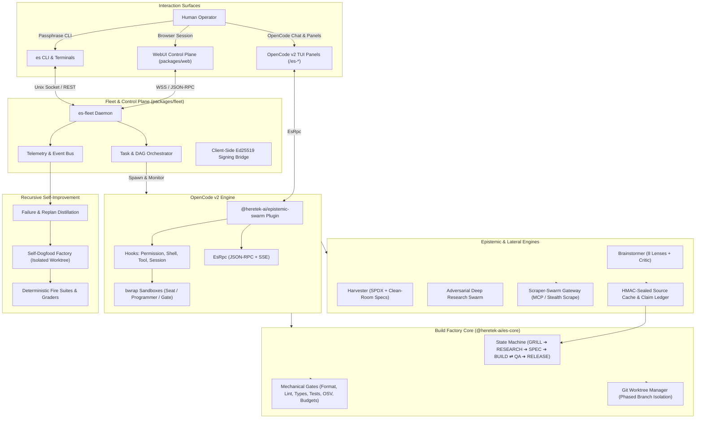
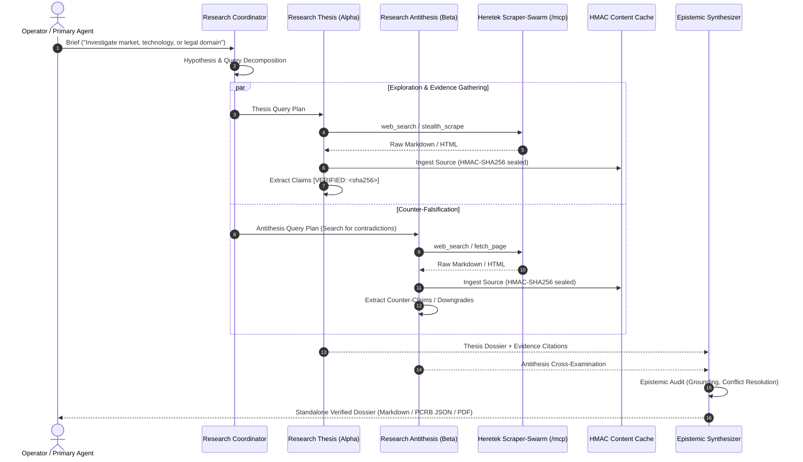
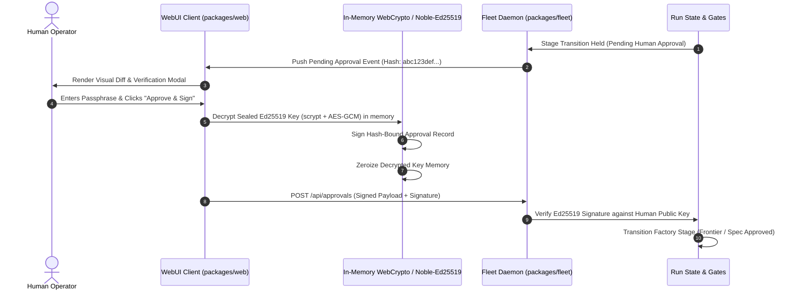
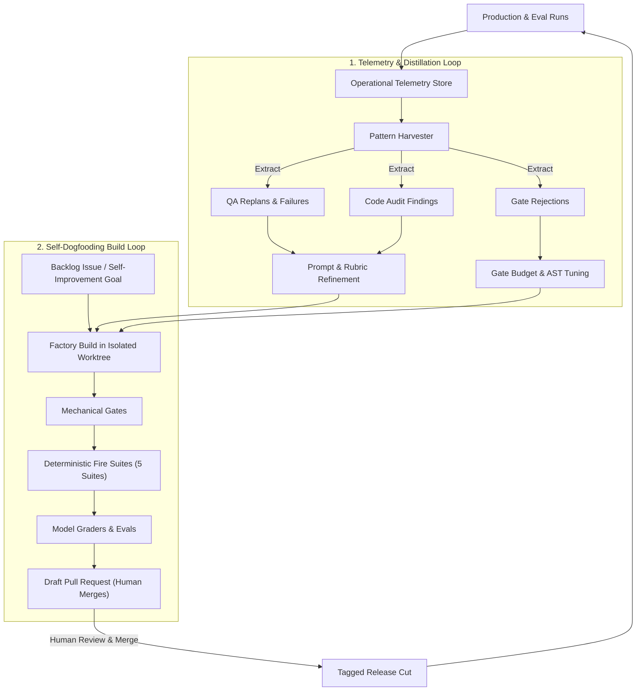
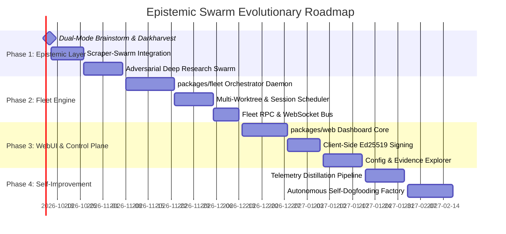

> **Archived 2026-10-08. Superseded by the phase epics on GitHub.** This is the original vision document behind roadmap issues #69–#84. Those issues are closed; the tickets that replaced them were checked against the code and follow ADR 0001 (`docs/adr/0001-monorepo.md`) and the user's 2026-10-08 decisions. Use the epics, not this file, for planning:
>
> | Phase | Epic | Version |
> |---|---|---|
> | 0 · Hardening | [#90](https://github.com/Heretek-AI/IUMBTEMS/issues/90) | 1.1.5 |
> | 1 · Epistemic layer | [#91](https://github.com/Heretek-AI/IUMBTEMS/issues/91) | 1.2.0 |
> | 2 · Approvals everywhere (TUI, CLI, browser) | [#92](https://github.com/Heretek-AI/IUMBTEMS/issues/92) | 1.3.0 |
> | 3 · Fleet | [#93](https://github.com/Heretek-AI/IUMBTEMS/issues/93) | 1.4.0 |
> | 4 · Web control plane | [#94](https://github.com/Heretek-AI/IUMBTEMS/issues/94) | 1.5.0 |
> | 5 · Self-improvement | [#95](https://github.com/Heretek-AI/IUMBTEMS/issues/95) | 1.6.0 |
> | Scraper-Swarm gateway contract v1 | [Heretek-AI/scraper-swarm#3](https://github.com/Heretek-AI/scraper-swarm/issues/3) | — |
>
> Known differences from the text below:
> - Brainstorm, harvest and deep research stay at depth 1. The callers fan out; nothing nests.
> - Approvals (only) move to the TUI and the browser under ADR 0002. Every other human action stays terminal-only.
> - The fire-suite names in §3.6 and §4 don't exist; the merge gate is `bun run check`.
> - Git alternates are unnecessary, because worktrees share the object store.

# IUMBTEMS / Epistemic Swarm: Master Architectural Roadmap

> **Vision:** Transform Epistemic Swarm from a single-session OpenCode build factory into a distributed, multi-seat epistemic intelligence and autonomous software manufacturing fleet — anchored by evidence-first verification, adversarial truth-seeking, and cryptographic human authorization.

---

## 1. Executive Summary & Design Principles

This roadmap expands **IUMBTEMS / Epistemic Swarm** across three evolutionary horizons while strictly preserving its core contract invariants:

1. **Evidence First & Mechanical Integrity:** Every factual claim is witnessed (`[VERIFIED]`, `[INFERRED]`, `[HYPOTHESIS]`, `[NEGATIVE_KNOWLEDGE]`), content-addressed, and HMAC-sealed. Irreversible decisions remain guarded by cryptographic human authorization.
2. **Dual-Mode Ergonomics:** Specialized lateral thinking tools (Brainstorm, Darkharvest, Deep Research) function interchangeably as interactive sparring partners for the human and as typed, callable subagents/tools for automated factory seats.
3. **Adversarial Truth-Seeking:** Facts and hypotheses are not accepted passively; they are stress-tested through thesis/antithesis agent pairs (Alpha/Beta, Auditor Thesis/Antithesis, QA Functional/Adversarial).
4. **Fleet-Scale Orchestration:** Coordinated execution across multiple sessions, git worktrees, and repositories managed by a dedicated daemon (`es-fleet`), monitored via an interactive WebUI control plane.
5. **Bounded Recursive Self-Improvement:** The system mines its own operational telemetry (replans, QA failures, audit catches) to optimize prompts, gate heuristics, and domain packs, while dogfooding feature development against its deterministic fire suites.

---

## 2. System Architecture & Topology

---

## 3. Subsystem Breakdown

### 3.1. Subsystem 1: Dual-Mode Epistemic Layer (Brainstorm & Darkharvest)

#### Problem Statement
Currently, `brainstormer` and `harvester` are configured strictly as primary interactive agents spawned via slash commands (`/brainstorm`, `/harvest`). They cannot be directly invoked as structured subagents by the Factory Manager, Grill, or an external conversational orchestrator to dynamically hunt for prior art, benchmark features, or ideate options mid-stream.

#### Architecture & Capabilities
1. **Dual Invocation Contract:**
   - **Interactive Mode:** The user launches `/brainstorm` or `/harvest` in OpenCode or the WebUI to engage in open dialogue, steer focus areas, and inspect interim outputs.
   - **Subagent / Tool Mode:** Registered as callable subagents (`es-brainstormer`, `es-harvester`) and high-level tools:
     - `es_brainstorm_fanout(prompt: string, lenses?: string[], rubric?: string)`: Runs the 8 divergent lenses in parallel, executes the critic deduplication and scoring rubric, writes `.factory/brainstorm/`, and returns structured candidate options to the calling agent.
     - `es_harvest_target(targets: string[], objective: string)`: Runs repository teardowns, license scanning via SPDX template matching, generates feature matrices, and writes clean-room specs to `.factory/harvest/`.
2. **Path Scoping & Sandboxing:**
   - Retains strict per-seat write scoping: `brainstorm` seats write exclusively to `.factory/brainstorm/notes/`; `harvester` writes exclusively to `.factory/harvest/notes/`.
   - Control files and core factory state remain deny-write.
3. **Artifact Integration:**
   - Output artifacts (`shortlist.json`, `matrix.json`, `specs/*.md`) are automatically registered into the factory's design tree (`frontier.json`) and spec pipeline.

---

### 3.2. Subsystem 2: Dual-Seat Adversarial Deep Research Swarm & Scraper-Swarm Integration

#### Problem Statement
Factory research (`research-alpha` and `research-beta`) is currently tightly tethered to software development projects and the internal `.factory/` directory structure. Users require a general-purpose, standalone deep research agent capable of executing open-ended, non-code fact-finding missions with high-scale stealth scraping and adversarial rigor.

#### Architecture & Workflow

#### Key Components:
1. **Scraper-Swarm Gateway Integration:**
   - Direct connection to `/home/john/Projects/scraper-swarm` via its gateway JSON-RPC `/mcp` endpoint.
   - Authenticated via scoped agent tokens (`["search", "scrape"]`) issued by `panel-api`.
   - Leverages Scraper-Swarm's SSRF protection (`deny_reason_for_url`), Smokescreen outbound proxy, and rate-limiting bucket.
   - Built-in fallback: If Scraper-Swarm gateway is offline, gracefully degrades to cached SearXNG/Brave or host websearch.
2. **Claim Ledger & Sealing:**
   - All fetched bytes are saved into content-addressed sha256 files sealed with `engine.key` HMAC.
   - Every claim in the generated brief must carry an evidence tag: `[VERIFIED: <sha256>]`, `[INFERRED: <parents>]`, `[HYPOTHESIS: <test>]`, or `[NEGATIVE_KNOWLEDGE: <query>]`.
3. **Repository-Free Export:**
   - Operates in standalone mode without requiring a git repository or `.factory/` software project.
   - Outputs verifiable, standalone dossiers exportable to Markdown, HTML, and PCRB (Proof of Content Research Brief) cryptographic bundles.

---

### 3.3. Subsystem 3: Deep OpenCode v2 Integration Matrix

OpenCode v2 provides an extensive, modular plugin architecture. Epistemic Swarm leverages this surface across both Server (engine) and Client (TUI) domains:

| OpenCode v2 Domain | Hook / API Used | Swarm Enforcement & Purpose |
| :--- | :--- | :--- |
| **`ctx.agent`** | `agent.transform(...)` | Compiles canonical registry into OpenCode v2 agents with wildcard permissions, custom system prompts, and model tier assignments. |
| **`ctx.tool`** | `tool.transform(...)` `hook("execute.before")` `hook("execute.after")` | Registers `es_*` tools. Intercepts and blocks unsafe actions. Intercepts web searches and fetches to cache content-addressed sources. |
| **`ctx.permission`** | `hook("evaluate")` | Evaluates fine-grained access control before tool execution; enforces deny-write on control files (`.factory/**`, `.git/config`). |
| **`ctx.shell`** | `hook("create.before")` | Injects sandboxed environment variables and wraps execution in Linux `bwrap` (Bubblewrap) containers per seat role. |
| **`ctx.session`** | `hook("prompt")` `hook("context")` `hook("compaction")` | Dynamic context injection, prompt auditing, and compaction protection for factory invariants. |
| **`ctx.rpc`** | `rpc.register(EsRpc, ...)` | Exposes strongly-typed JSON-RPC methods and SSE `changed` events for status, liveness, and panel rendering. |
| **`ctx.command`** | `command.transform(...)` | Registers palette commands (`/grill`, `/factory`, `/brainstorm`, `/harvest`, `/design`, `/scout`, `/audit`). |
| **`session.panel`** | SolidJS Panel Slot | Renders custom interactive panels inside the OpenCode TUI: Factory Dashboard, LSP Manager, Hooks Inspector, Brainstorm Board. |
| **`prompt.footer`** | Footer Slot | Renders live seat status, active run stage, and spend indicators right above the prompt. |
| **`context.ui`** | `dialog.alert`, `confirm`, `toast` | Displays modal dialogs and toasts for human inspection of pending approvals and state warnings. |
| **`keymap.layer`** | Keymap Layering | Binds scoped keys (`Esc`, `q`, `f`, `r`) strictly to active TUI panel instances. |

---

### 3.4. Subsystem 4: Distributed Fleet Orchestration Engine (`packages/fleet`)

#### Problem Statement
Executing complex projects sequentially in a single terminal session creates bottlenecks. A project may have parallel phases (frontend, backend, documentation), multiple worktrees, or require coordinated multi-repo work (e.g. coordinating `IUMBTEMS` and `scraper-swarm`).

#### Architecture: The `es-fleet` Daemon
`packages/fleet` introduces a lightweight, robust orchestration daemon:

1. **Job Graph & Scheduler:**
   - Manages a directed acyclic graph (DAG) of task units (e.g. `Brainstorm ➔ Research ➔ Spec ➔ [Build Backend || Build Frontend] ➔ Integration QA`).
   - Assigns task units to worker instances based on model tiers, tool capabilities, and worktree isolation.
2. **Worker Abstraction:**
   - **Headless OpenCode Workers:** Spawns and manages `opencode` instances running in server mode, controlling them via RPC and session hooks.
   - **Headless CLI Workers:** Runs targeted `es` commands (`es build`, `es qa`, `es audit`, `es harvest`) in isolated git worktrees.
3. **Multi-Worktree Coordination:**
   - Allocates dedicated git worktrees for each concurrent task (`.fleet/worktrees/<task-id>/`).
   - Ensures no two active programmers or QA agents touch the same working directory.
   - Merges verified phase branches into integration worktrees only after mechanical gate approval.
4. **Unified Fleet Bus:**
   - Real-time WebSocket and HTTP API for telemetry, streaming logs, seat liveness fingerprints, and job states to the WebUI and CLI.

---

### 3.5. Subsystem 5: Web-Centric Control Plane (`packages/web`)

#### Architecture & Security Design
The WebUI provides full observability, interactive configuration, and a **browser-native cryptographic approval channel**:

#### Key Capabilities:
1. **Interactive Fleet Dashboard:**
   - Visual DAG of all active runs, stages, and worktree branches.
   - Real-time seat liveness indicators (who is thinking, running tools, or blocked).
   - Live token and USD spend tracking against ceilings.
2. **Configuration & Policy Management:**
   - Visual editors for `gates.json`, model tier mappings, and domain packs.
   - Diff preview against control-file hashes with rebaseline warnings.
3. **Evidence & Claim Explorer:**
   - Interactive claim graph with citations, verbatim quotes, and witness states (`VERIFIED`, `INFERRED`, `HYPOTHESIS`).
   - Source cache inspector showing sealed document contents.
4. **Client-Side Cryptographic Signing:**
   - Sealed Ed25519 key remains encrypted with scrypt + AES-256-GCM.
   - Passphrase entry decrypts the key in client-side memory strictly for signing; raw private keys are **never transmitted** over the wire to the daemon or cloud.

---

### 3.6. Subsystem 6: Recursive Self-Improvement Engine

Recursive self-improvement is implemented not as unconstrained self-rewriting, but as a **tight, mechanically gated evolutionary loop**:

#### Key Guarantees:
1. **Deterministic Bounding:** Any self-generated change to prompts, tools, or core code must pass all five merge-blocking fire suites (`grill-fires`, `factory-gate`, `darkharvest-fires`, `audit-fires`, `scout-fires`) and drift checks.
2. **Non-Negotiable Human Cutover:** The factory cannot push directly to `main` or cut releases autonomously; it opens draft PRs for human review and cryptographic approval.
3. **Empirical Knowledge Accumulation:** Successful research methodologies and domain definitions are archived into reusable domain packs (`packages/core/assets/domain/`).

---

## 4. Phased Milestone Roadmap

### Milestone 1: Epistemic & Lateral Agent Layer (Target: 3 Weeks)
- [ ] Export `brainstormer` and `harvester` as typed subagent tools (`es_brainstorm_fanout`, `es_harvest_target`).
- [ ] Implement Scraper-Swarm gateway MCP client in `packages/core/src/research/scraperswarm.ts` with rate-limiting and fallback to SearXNG/host websearch.
- [ ] Build the standalone `deep-researcher` adversarial swarm (Thesis + Antithesis + Synthesizer).
- [ ] Add CLI verbs: `es research deep <query> --output <path>` and `es harvest scan <repo>`.
- [ ] Add merge-blocking fire suite `research-fires.test.ts` proving claim verification, quote matching, and Scraper-Swarm fallback.

### Milestone 2: Fleet Orchestration Daemon (`packages/fleet`) (Target: 4 Weeks)
- [ ] Create `packages/fleet` within the Bun workspace.
- [ ] Implement the DAG Task Scheduler and Worktree Coordinator (`.fleet/worktrees/`).
- [ ] Implement the headless OpenCode session runner using `ctx.session.create` and process management.
- [ ] Expose unified JSON-RPC and WebSocket event stream (`/fleet/ws`, `/fleet/api`).
- [ ] CLI command `es fleet start --port 8080` and `es fleet status`.
- [ ] Integration tests verifying concurrent worktree isolation and tiebreak resolution across sessions.

### Milestone 3: Web-Centric Control Plane (`packages/web`) (Target: 3 Weeks)
- [ ] Create `packages/web` (Vite + React / Tailwind or SolidJS) connecting to `es-fleet`.
- [ ] Build real-time fleet DAG and seat liveness dashboard.
- [ ] Implement in-memory WebCrypto / Noble-Ed25519 client-side passphrase unlock and hash-bound signing.
- [ ] Build interactive Evidence Graph and Claim Inspector with verbatim source quote viewing.
- [ ] Visual editors for `config.json`, `gates.json`, and domain packs with hash diff preview.

### Milestone 4: Recursive Self-Improvement & Fleet Telemetry (Target: 3 Weeks)
- [ ] Build telemetry event collector in `packages/fleet` logging QA replan causes, code audit catches, and gate rejections.
- [ ] Build distillation pipeline extracting high-frequency failure patterns into domain packs and prompt adjustments.
- [ ] Implement self-dogfooding factory pipeline: tasked with internal issues, executing in worktrees, and running the five fire suites.
- [ ] End-to-end evaluation suite measuring factory success rate and replan count improvements over iterations.

---

## 5. Risk Assessment & Mitigations

| Risk | Impact | Mitigation |
| :--- | :--- | :--- |
| **Browser Key Exposure** | Critical | Private keys are decrypted in client-side RAM only during the signing action and immediately zeroized; keys are never stored unencrypted in `localStorage` or transmitted across the network. |
| **Scraper-Swarm Downtime** | Moderate | The research client implements automatic fallback to configured host web search / SearXNG with warning tags in the dossier metadata. |
| **Multi-Worktree Disk Growth** | Moderate | Fleet orchestrator prunes completed and released worktrees automatically; worktrees share git object storage via git alternates. |
| **Recursive Drift / Hallucination** | High | Invariant #7 and deterministic fire suites remain merge-blocking; self-improvement proposals require explicit human review and cryptographic merge approval. |
| **OpenCode v2 API Churn** | Low | Integration is maintained against upstream v2 HEAD via `scripts/v2-head.sh` nightly compatibility CI. |

---

## 6. Verification & Proof Artifacts

Every milestone will produce enforceable proofs in accordance with `AGENTS.md`:
1. **Capability Matrix Entries:** Added to `packages/core/src/capabilities.ts` and validated via `bun run docs:check`.
2. **Fire Suites:** Deterministic, in-process host test suites in `packages/opencode/test/` proving zero-drift execution.
3. **Spike Records:** Saved in `spikes/M<N>-<name>/RESULTS.md` with benchmark timings and token expenditures.
